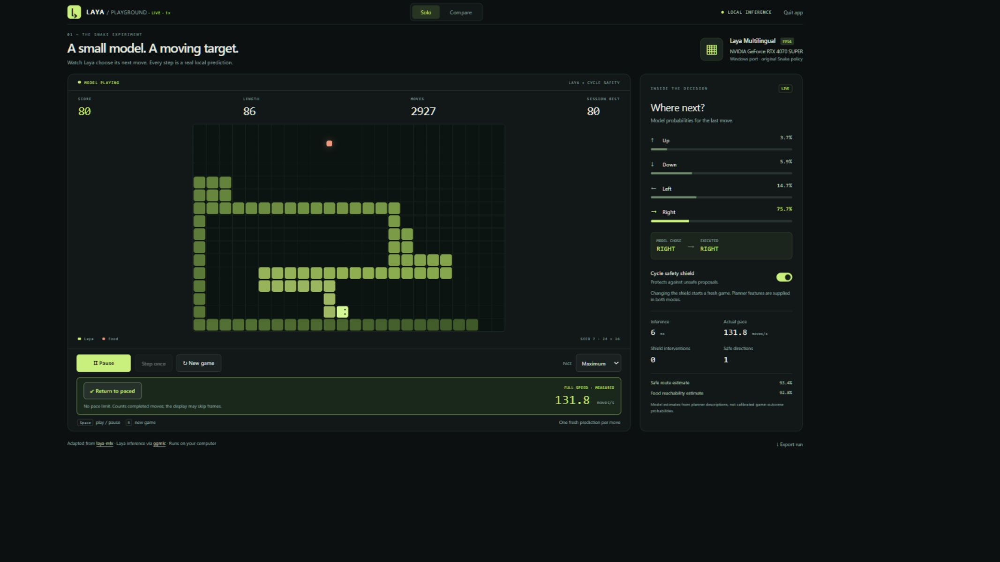
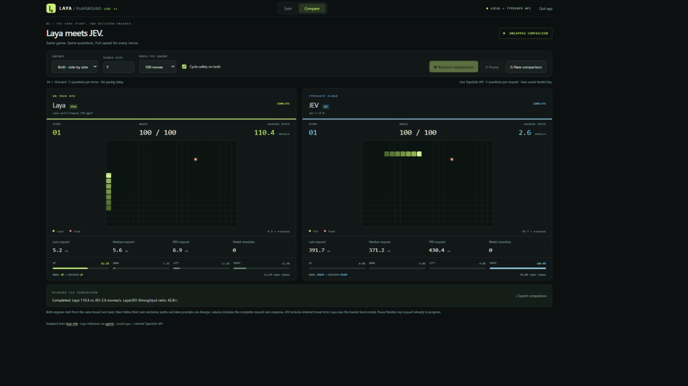

# Laya Snake Arena

[](https://github.com/sathwikkuncham/laya-snake-arena/actions/workflows/ci.yml)
[](LICENSE)

**Configurable decision engines. The same Snake arena. Real predictions.**

A local Snake playground for Laya, with an optional live comparison against
TypeSafe JEV. Every move uses a new model prediction. The browser shows the
proposed direction, the executed direction, and measured request latency.

This ports the Snake engine and policy from
[mizorewww/laya-mlx](https://github.com/mizorewww/laya-mlx) to a persistent
[ggmlc Laya executable](https://github.com/monatis/ggmlc/tree/main/examples/laya).
The interface and Windows launcher are new. Model weights are not included.

[](https://github.com/sathwikkuncham/laya-snake-arena/releases/download/v0.1.0/laya-solo.mp4)

**Demos:** [solo, 30 seconds](https://github.com/sathwikkuncham/laya-snake-arena/releases/download/v0.1.0/laya-solo.mp4)
· [Laya vs JEV, 46 seconds](https://github.com/sathwikkuncham/laya-snake-arena/releases/download/v0.1.0/laya-vs-jev.mp4)
· [method and limitations](docs/RECORDINGS.md)

**Guides:** [configuration](docs/CONFIGURATION.md) · [add an engine](docs/EXTENDING.md)
· [contributing](CONTRIBUTING.md) · [security](SECURITY.md)

## Quick start

Requirements: **Windows x64, Python 3.11+, and an NVIDIA GPU supported by your
chosen laya.exe build**. Tested with Python 3.13 and an RTX 4070 SUPER (12 GB).
The app has no third-party Python dependencies.

1. Clone or download this source repository:

   ```powershell
   git clone https://github.com/sathwikkuncham/laya-snake-arena.git
   cd laya-snake-arena
   ```
2. Download a compatible `laya.exe` from
   [ggmlc releases](https://github.com/monatis/ggmlc/releases).
   The recorded version is v0.9.1. RTX 40-series uses the Windows `sm89` ZIP;
   the documented Windows `sm86` ZIP targets supported RTX 30-series hardware.
   Extract the archive and put its contents in `bin/`.
3. Download **`laya_multilingual_f16.gguf`** from
   [mys/laya-multilingual-GGUF](https://huggingface.co/mys/laya-multilingual-GGUF/tree/main)
   and place it in `models/`. This GGUF requires ggmlc; it is not a llama.cpp model.
4. Launch from PowerShell in this directory:

   ```powershell
   python .\app.py --open
   ```

   Or double-click **Start Laya Snake.vbs** for a hidden-console launch.
   The launcher finds `pythonw.exe` on PATH or in `.venv\Scripts`.

The default address is **http://127.0.0.1:8765**. Wait for the model to warm up,
then click **Start game**. Use **Quit app** to stop the server and release the
model; closing the tab alone does not stop the process.

If your binary or model is elsewhere, copy `config.example.json` to `config.json`
and update the two paths. Relative paths resolve from the app directory.
See the [full configuration guide](docs/CONFIGURATION.md).

## Configuration and extensions

Configure board dimensions, starting length, seed, prompt style, safety defaults,
solo pacing, recording retention, and comparison move limits in `config.json`.
Invalid combinations are rejected before the server starts.

The `engines` mapping defines one to four named engines. Each chooses a provider,
display metadata, and provider options. The browser creates the selector and
comparison cards from this registry, so adding an engine does not require HTML
or controller changes. `solo_engine` chooses the engine used in the solo view.

Built-in providers are `ggmlc` (local Laya) and `typesafe` (JEV). Local Python
plugins can register another factory implementing `predict(state, questions)`
and `close()`. Results are validated before a move can execute. Follow the
[step-by-step extension guide](docs/EXTENDING.md), including the clearly labeled
deterministic, non-AI example.

## Solo controls

- Start / Pause, or Space: run or pause Laya.
- Step once: inspect one real decision.
- New game, or R: start a fresh seeded board.
- Pace: choose a viewing speed.
- Run at full speed: remove pacing and show actual completed moves per second.
- Cycle safety shield: filter unsafe proposals using the original planner.
- Export run: download decisions and their before/after board states.

**Score means food eaten. Moves means individual steps.** Each food increases the
score by one; hundreds of moves need not produce hundreds of points.

## Compare with TypeSafe JEV

Copy `.env.example` to `.env`, then set your TypeSafe key locally:

```dotenv
TYPESAFE_API_KEY=your-key-here
```

Restart the app. Click **Compare** and choose **Laya**, **JEV**, or **Both**. Select
the shared seed, safety setting, and move limit, then start the comparison.
JEV makes real, metered calls through your TypeSafe account. Only synthetic game
features and typed questions are sent. The key is handled by the Python server
and is never included in browser state or game exports.

[](https://github.com/sathwikkuncham/laya-snake-arena/releases/download/v0.1.0/laya-vs-jev.mp4)

Every comparison runs uncapped, with one sequential request per move per engine.
Both engines use the same initial board, seed, original prompt-building logic,
shield setting, and move limit. They follow their own decisions, so later paths
and prompts may differ. A finished local run does not wait between moves for JEV.

The panels show average moves/s, last/median/P95 request time, score, and shield
overrides. Local Laya uses a resident model; JEV timings include HTTPS travel and
the first-call connection setup. This is a gameplay demonstration of local versus
remote execution, not a controlled hardware-only benchmark or a general model
quality ranking. See [recording notes](docs/RECORDINGS.md).

## What the model sees

The planner supplies descriptions such as "safe," "blocked," and "best route to
food." The original Laya policy asks three typed questions per move: direction,
safe-route availability, and food reachability. With the shield enabled, it
executes the highest-probability admissible move. Raw and executed choices remain
visible, and interventions are counted.

Turning the shield off still supplies planner features. Neither mode demonstrates
learning Snake strategy from an unprocessed board. Reachability estimates are
model outputs, not calibrated probabilities of future death or victory.

## Project layout

```text
app.py                 Local HTTP server and solo session
backend.py             Persistent ggmlc process
jev_backend.py         Direct TypeSafe HTTPS client
compare.py             Independent matched-configuration runs
settings.py            Local configuration and .env loader
providers.py           Backend contract, validation, and provider registry
plugins/               Optional local extension examples
static/                Browser UI and shared canvas renderer
upstream/              Original game and adapted policy, with license notices
tests/                 Offline configuration and comparison checks
docs/                  Setup, recordings, and publishing instructions
```

Run the offline checks with:

```powershell
python -m unittest discover -s tests -v
```

The tests use local fakes and do not call TypeSafe or load model weights.
CI runs these checks on Windows and Linux with Python 3.11 and 3.13. GPU model
execution has been tested on the Windows hardware listed above; the Linux CI
job validates the portable server and interfaces, not GPU support.
Live demonstrations were also verified with the actual RTX 4070 SUPER and
TypeSafe `jev-1.13.0`. [Recorded results](docs/recorded-comparison.json) describe
one captured run, not expected performance on every machine.

## License and attribution

Apache-2.0; see [LICENSE](LICENSE) and [NOTICE](NOTICE). Original Laya models are
by Convai Innovations and contributors. Original Snake code is from laya-mlx.
The separately downloaded ggmlc executable has its own license. This project is
an independent adaptation, not an official release from those projects or TypeSafe.
